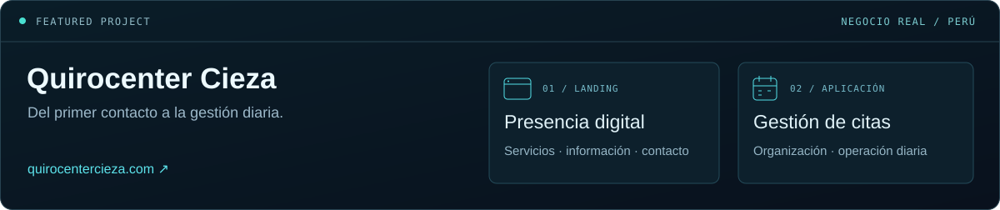
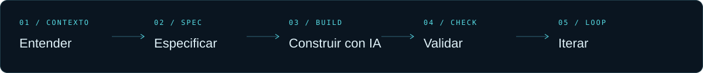

  

  
  &nbsp;
  

### Construir con IA. Resolver algo real.

Soy **Josué**, y estoy orientando mi camino al **desarrollo de sistemas con IA y al marketing digital**. Me interesa conectar lo que un negocio necesita con productos que pueda usar: desde una landing hasta una aplicación para su operación diaria.

**Codex es mi herramienta principal de desarrollo.** Trabajo con agentes de IA, exploro prototipos y sigo aprendiendo a convertir una idea en una solución verificable. Mi curiosidad fuera del código también tiene nombre: estar al día con las novedades de inteligencia artificial y probar qué merece llevarse a la práctica.

---

### 01 / Trabajo en el mundo real

**Quirocenter Cieza** es un negocio real para el que he desarrollado dos piezas complementarias:

| Presencia digital | Gestión de citas |
| :--- | :--- |
| Landing para presentar el negocio, sus servicios y facilitar el contacto de nuevos clientes. | Aplicación interna para organizar las citas y apoyar el trabajo diario del centro. |
| **[Visitar la web ↗](https://quirocentercieza.com/)** | **Proyecto de cliente · código privado** |

Este proyecto reúne la dirección en la que quiero crecer: **presencia digital + software útil para el negocio**.

### 02 / Mi forma de construir

Estoy adoptando **[Spec-Driven Development](https://github.com/github/spec-kit)**: definir lo que debe hacer el producto, dar contexto al agente y comprobar el resultado. Complemento este enfoque con conceptos de metodologías ágiles como **Scrum**.

Me interesa mejorar en la parte que conecta todo el proceso: **plantear bien el problema, dirigir el trabajo con IA y evaluar si la solución cumple su propósito**.

### 03 / Herramientas que forman parte de mi camino

Mi experiencia varía entre herramientas; esta es mi base actual de trabajo y aprendizaje.

| Área | Herramientas y experiencia |
| :--- | :--- |
| **Desarrollo con IA** | **Codex** como herramienta principal · Antigravity · Google AI Studio para prototipos rápidos |
| **Datos y backend** | SQL Server · Supabase · SQLite |
| **Desarrollo** | C# · Visual Basic · desarrollo Android asistido por Codex |
| **Publicación y nube** | Netlify · Vercel · exploración de Google Cloud Platform |
| **Análisis** | Excel · Power BI |
| **Método** | Spec-Driven Development en adopción · fundamentos de Scrum |

### 04 / En mi radar

- **IA aplicada:** agentes, nuevas herramientas y formas de desarrollar mejor.
- **Marketing digital:** cómo conectar presencia online, comunicación y objetivos del negocio.
- **Productos útiles:** aplicaciones web y Android que resuelvan necesidades concretas.

---

  <strong>¿Una idea que necesita convertirse en algo útil?</strong> 
  Hablemos de IA, desarrollo y negocios.  
  <a href="mailto:saldanafustamantejosue@gmail.com">saldanafustamantejosue@gmail.com</a>

ETWIN74 &nbsp; / &nbsp; APRENDER · CONSTRUIR · ITERAR

