  <picture>
    <source media="(max-width: 1000px)" srcset="./assets/hero-mobile.svg" />
    
  </picture>

  <picture>
    <source media="(max-width: 1000px)" srcset="./assets/identity-mobile.svg" />
    
  </picture>

  <a href="https://quirocentercieza.com/">
  <picture>
    <source media="(max-width: 1000px)" srcset="./assets/quirocenter-mobile.svg" />
    
  </picture>
  </a>

  <picture>
    <source media="(max-width: 1000px)" srcset="./assets/experience-mobile.svg" />
    
  </picture>

  <picture>
    <source media="(max-width: 1000px)" srcset="./assets/workflow-mobile.svg" />
    
  </picture>

  <a href="mailto:saldanafustamantejosue@gmail.com">
  <picture>
    <source media="(max-width: 1000px)" srcset="./assets/connect-mobile.svg" />
    
  </picture>
  </a>

